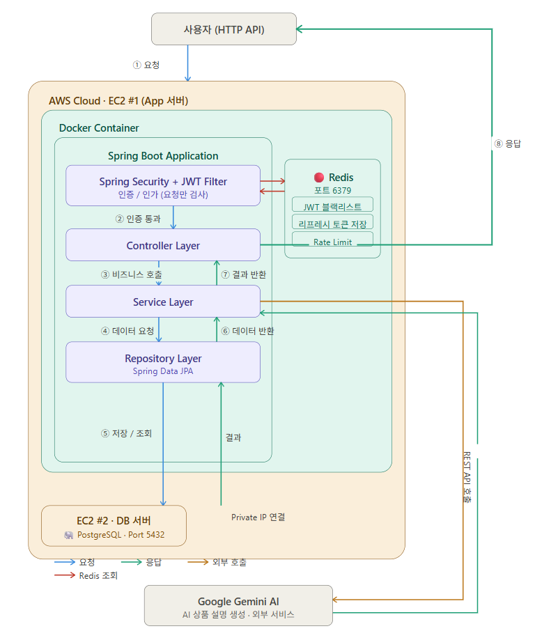
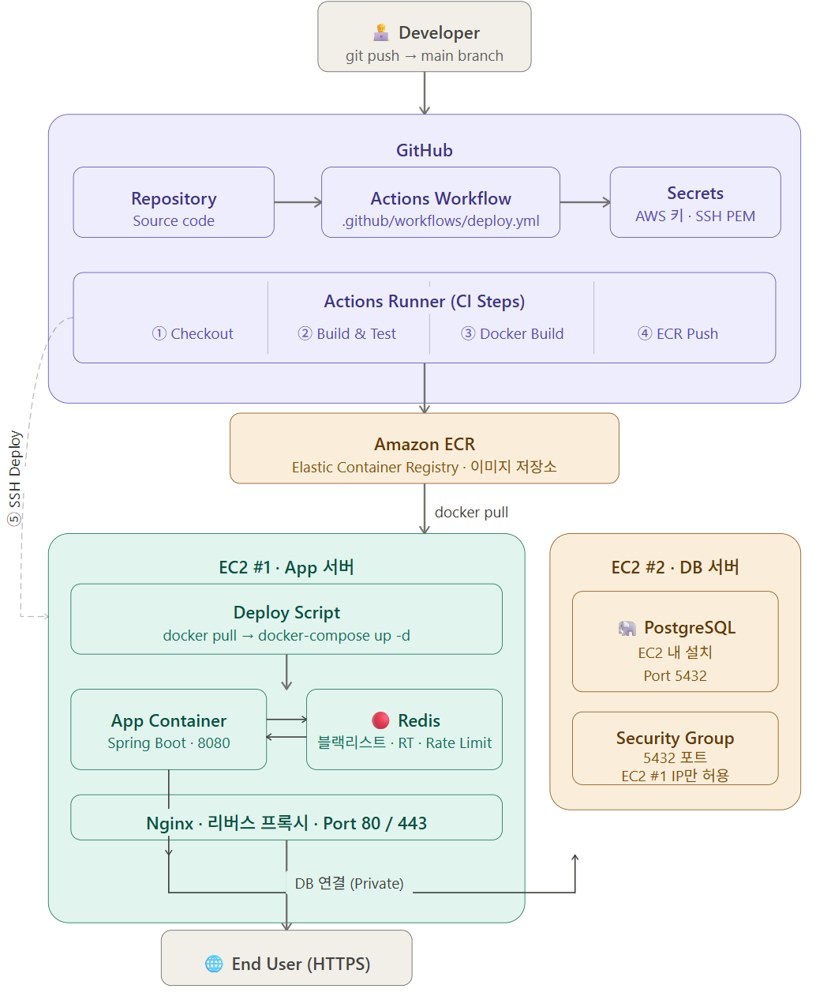

# 아키텍처

---

## 인프라 아키텍처

AWS EC2 두 대로 App 서버와 DB 서버를 분리한 구조입니다.  
App 서버(EC2 #1)에서는 Docker 컨테이너로 Spring Boot 애플리케이션과 Redis가 실행되며, DB 서버(EC2 #2)의 PostgreSQL과는 Private IP로 통신합니다.

### 서버 구성

| 서버 | 구성 요소 | 설명 |
|------|----------|------|
| EC2 #1 (App 서버) | Spring Boot | Docker 컨테이너로 실행, 포트 8080 |
| EC2 #1 (App 서버) | Redis | JWT 블랙리스트 · 리프레시 토큰 · Rate Limit, 포트 6379 |
| EC2 #2 (DB 서버) | PostgreSQL | EC2 #1과 Private IP로 연결, 포트 5432 |

### 요청 처리 흐름

| 단계 | 설명 |
|------|------|
| ① 요청 | 사용자가 HTTP API 호출 |
| ② 인증 통과 | Spring Security + JWT Filter에서 토큰 검증 및 인증/인가 처리 |
| ③ 비즈니스 호출 | Controller → Service Layer로 요청 전달 |
| ④ 데이터 요청 | Service → Repository Layer로 데이터 조회/저장 요청 |
| ⑤ 저장 / 조회 | Repository가 EC2 #2의 PostgreSQL에 Private IP로 쿼리 실행 |
| ⑥ 데이터 반환 | 쿼리 결과를 Service로 반환 |
| ⑦ 결과 반환 | Service → Controller로 처리 결과 반환 |
| ⑧ 응답 | 최종 응답을 사용자에게 반환 |

### Redis 활용

JWT Filter와 Service Layer는 같은 EC2 #1 내의 Redis와 통신하며, 다음 세 가지 용도로 사용합니다.

| 용도 | 설명 |
|------|------|
| JWT 블랙리스트 | 로그아웃된 토큰 등록, 남은 만료시간 TTL로 자동 삭제 |
| 리프레시 토큰 저장 | 로그인 시 발급된 Refresh Token 보관 |
| Rate Limit | IP별 로그인 시도 횟수 관리, 60초 내 10회 초과 시 차단 |

### 외부 서비스

| 서비스 | 용도 |
|--------|------|
| Google Gemini AI | 메뉴 AI 상품 설명 자동 생성 (REST API 호출) |

---

## 배포 아키텍처

`main` 브랜치에 코드가 병합되면 GitHub Actions가 자동으로 빌드·배포를 수행하는 CI/CD 파이프라인입니다.

### CI/CD 파이프라인 흐름

| 단계 | 위치 | 설명 |
|------|------|------|
| ① Checkout | GitHub Actions Runner | 소스 코드 체크아웃 |
| ② Build & Test | GitHub Actions Runner | Gradle 빌드 및 테스트 실행 |
| ③ Docker Build | GitHub Actions Runner | Docker 이미지 빌드 |
| ④ ECR Push | Amazon ECR | 빌드된 이미지를 ECR 저장소에 푸시 |
| ⑤ SSH Deploy | EC2 #1 (App 서버) | SSH 접속 후 배포 스크립트 실행 (`docker pull` → `docker-compose up -d`) |

### 서버 구성

**EC2 #1 — App 서버**

| 컴포넌트 | 설명 |
|---------|------|
| Spring Boot | 포트 8080, 애플리케이션 서버 |
| Redis | 블랙리스트 · 리프레시 토큰 · Rate Limit |
| Nginx | 리버스 프록시, Port 80 / 443 수신 후 8080으로 포워딩 |

**EC2 #2 — DB 서버**

| 컴포넌트 | 설명 |
|---------|------|
| PostgreSQL | 포트 5432, 애플리케이션 데이터 저장 |
| Security Group | EC2 #1의 IP에서 오는 5432 포트 요청만 허용 (외부 직접 접근 차단) |
