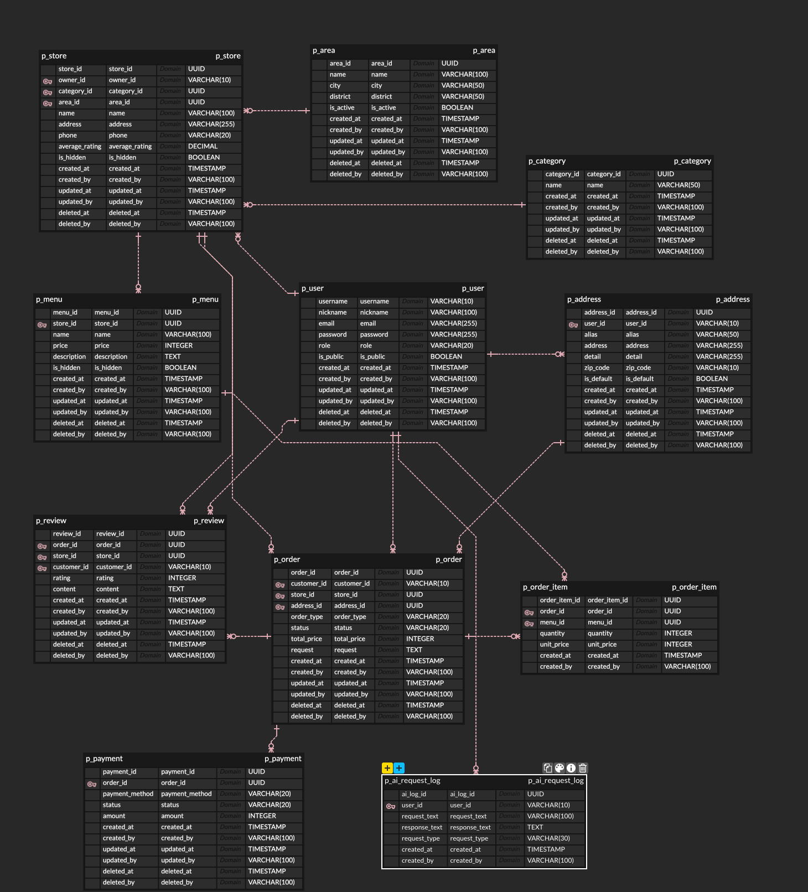

# 데이터베이스 설계

## ERD

> ERD 원본은 [ERDCloud](https://www.erdcloud.com/) 에서 관리합니다. _https://www.erdcloud.com/d/jD68qBPyGAC2Ni9Yf_

---

## 테이블 관계 요약

| 관계 | 카디널리티 | 설명 |
|------|-----------|------|
| User ↔ Store | 1:N | OWNER 한 명이 여러 가게 소유 |
| User ↔ Order | 1:N | CUSTOMER 한 명이 여러 주문 |
| User ↔ Address | 1:N | 사용자별 여러 배송지 |
| User ↔ AI Log | 1:N | 사용자별 여러 AI 요청 |
| User ↔ Review | 1:N | 사용자별 여러 리뷰 |
| Area ↔ Store | 1:N | 지역별 여러 가게 |
| Category ↔ Store | 1:N | 카테고리별 여러 가게 |
| Store ↔ Menu | 1:N | 가게별 여러 메뉴 |
| Store ↔ Order | 1:N | 가게별 여러 주문 |
| Store ↔ Review | 1:N | 가게별 여러 리뷰 (역정규화) |
| Order ↔ OrderItem | 1:N | 주문별 여러 주문 상품 |
| Order ↔ Review | 1:1 | 주문당 리뷰 1개 (UNIQUE) |
| Order ↔ Payment | 1:1 | 주문당 결제 1건 (UNIQUE) |
| Menu ↔ OrderItem | 1:N | 메뉴별 여러 주문 상품 |

---

## 설계 주요 결정 사항

**소프트 삭제 (Soft Delete)**
대부분의 테이블에 `deleted_at` 컬럼을 두어 실제 데이터를 삭제하지 않고 삭제 시각만 기록합니다. 주문/결제 이력 보존 및 감사 추적을 위한 결정입니다.

**UUID 기본 키**
`p_user`를 제외한 모든 테이블은 UUID를 PK로 사용합니다. 분산 환경 확장성과 순차 ID 노출 방지를 위한 결정입니다.
