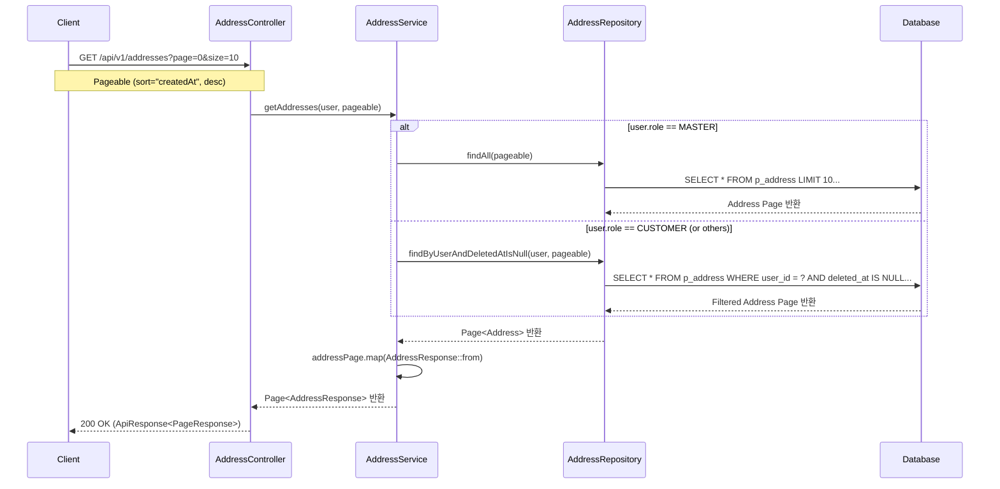

## 배송지 목록 조회

### 주요 로직
- 권한별 조회 분기
  - MASTER: 전체 배송지 목록 조회
  - 그 외: 본인이 등록한 배송지 중 삭제되지 않은 배송지 목록만 조회

```mermaid
sequenceDiagram
    participant C as Client
    participant Ctrl as AddressController
    participant S as AddressService
    participant R as AddressRepository
    participant DB as Database

    C->>Ctrl: GET /api/v1/addresses?page=0&size=10
    Note over C, Ctrl: Pageable (sort="createdAt", desc)

    Ctrl->>S: getAddresses(user, pageable)
    
    alt user.role == MASTER
        S->>R: findAll(pageable)
        R->>DB: SELECT * FROM p_address LIMIT 10...
        DB-->>R: Address Page 반환
    else user.role == CUSTOMER (or others)
        S->>R: findByUserAndDeletedAtIsNull(user, pageable)
        R->>DB: SELECT * FROM p_address WHERE user_id = ? AND deleted_at IS NULL...
        DB-->>R: Filtered Address Page 반환
    end

    R-->>S: Page<Address> 반환
    S->>S: addressPage.map(AddressResponse::from)
    
    S-->>Ctrl: Page<AddressResponse> 반환
    Ctrl-->>C: 200 OK (ApiResponse<PageResponse>)
```