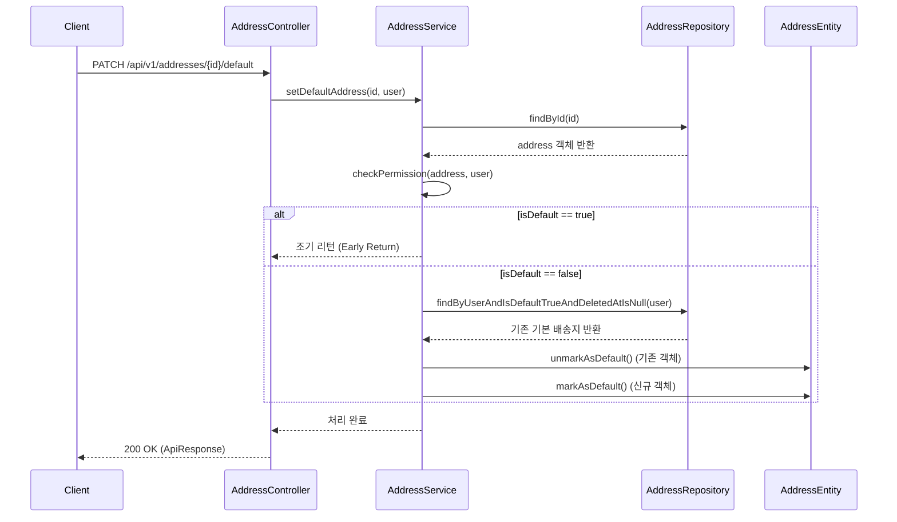

## 기본 배송지 설정

### 주요 로직
- 요청된 배송지 ID가 실제 해당 사용자의 소유인지 먼저 확인
- 선택한 배송지가 이미 기본 배송지 상태(isDefault == true)라면, 추가적인 DB 쿼리나 업데이트 없이 즉시 처리 완료
- 기존 기본 배송지 해제 및 새로운 기본 배송지 설정

```mermaid
sequenceDiagram
    participant C as Client
    participant Ctrl as AddressController
    participant S as AddressService
    participant R as AddressRepository
    participant E as AddressEntity

    C->>Ctrl: PATCH /api/v1/addresses/{id}/default
    Ctrl->>S: setDefaultAddress(id, user)
    S->>R: findById(id)
    R-->>S: address 객체 반환
    S->>S: checkPermission(address, user)
    
    alt isDefault == true
        S-->>Ctrl: 조기 리턴 (Early Return)
    else isDefault == false
        S->>R: findByUserAndIsDefaultTrueAndDeletedAtIsNull(user)
        R-->>S: 기존 기본 배송지 반환
        S->>E: unmarkAsDefault() (기존 객체)
        S->>E: markAsDefault() (신규 객체)
    end
    
    S-->>Ctrl: 처리 완료
    Ctrl-->>C: 200 OK (ApiResponse)
```