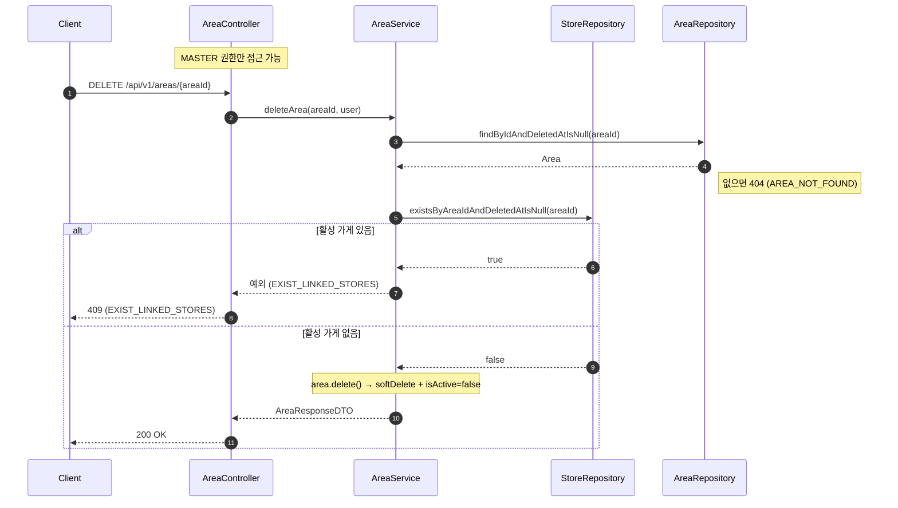

## 운영지역 삭제

**관련 도메인**: Area, Store  
**권한**: MASTER  
**핵심**: AreaService → StoreRepository 직접 참조 방식으로 순환참조 해결

### 주요 흐름
- 활성 가게가 있으면 삭제 불가 (409 EXIST_LINKED_STORES)
- 수정(비활성화) 시에도 동일한 validateNoActiveStores() 적용
  단, 활성 → 비활성 변경될 때만 조건부 실행

