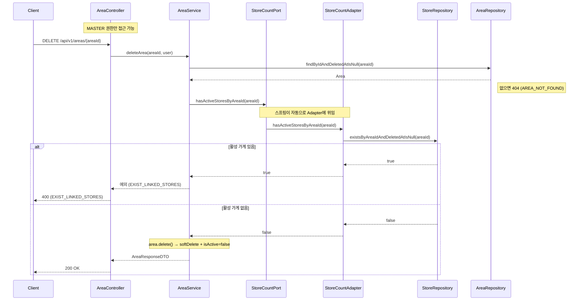

## 운영지역 삭제

**관련 도메인**: Area, Store  
**권한**: MASTER  
**핵심**: Port/Adapter 패턴으로 순환참조 해결

```mermaid
sequenceDiagram
    participant Client
    participant AreaController
    participant AreaService
    participant StoreCountPort
    participant StoreCountAdapter
    participant StoreRepository
    participant AreaRepository

    Note over AreaController: MASTER 권한만 접근 가능

    Client->>AreaController: DELETE /api/v1/areas/{areaId}

    AreaController->>AreaService: deleteArea(areaId, user)

    %% AreaService->>AreaRepository: findByIdAndDeletedAtIsNull(areaId)
    %% AreaRepository-->>AreaService: Area (없으면 404)

AreaService->>AreaRepository: findByIdAndDeletedAtIsNull(areaId)
AreaRepository-->>AreaService: Area
Note right of AreaRepository: 없으면 404 (AREA_NOT_FOUND)

    AreaService->>StoreCountPort: hasActiveStoresByAreaId(areaId)
    Note over StoreCountPort,StoreCountAdapter: 스프링이 자동으로 Adapter에 위임
    StoreCountPort->>StoreCountAdapter: hasActiveStoresByAreaId(areaId)
    StoreCountAdapter->>StoreRepository: existsByAreaIdAndDeletedAtIsNull(areaId)

    alt 활성 가게 있음
        StoreRepository-->>StoreCountAdapter: true
        StoreCountAdapter-->>AreaService: true
        AreaService-->>AreaController: 예외 (EXIST_LINKED_STORES)
        AreaController-->>Client: 400 (EXIST_LINKED_STORES)
    else 활성 가게 없음
        StoreRepository-->>StoreCountAdapter: false
        StoreCountAdapter-->>AreaService: false
        Note over AreaService: area.delete() → softDelete + isActive=false
        AreaService-->>AreaController: AreaResponseDTO
        AreaController-->>Client: 200 OK

    end
```