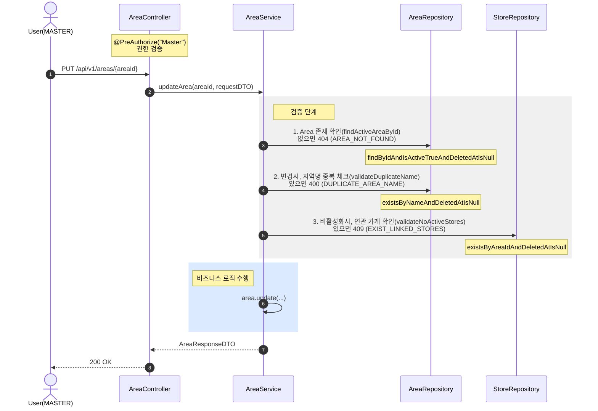

## 운영지역 업데이트

**관련 도메인**: Area, Store  
**권한**: MASTER  
**핵심**: AreaService → StoreRepository 직접 참조 방식으로 순환참조 해결

### 주요 흐름

- 지역명 변경 시, 중복 체크 (400 DUPLICATE_AREA_NAME)
- 비활성화 시, 연관 가게가 있으면 불가 (409 EXIST_LINKED_STORES)

