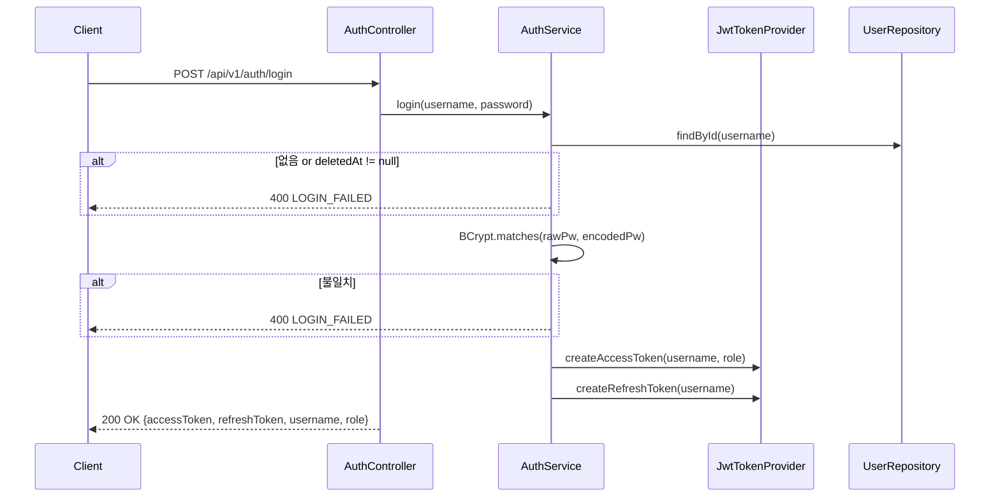

## 로그인

### 인증 방식: JWT
### 주요 로직
  - 계정 존재 여부 및 활성화 여부
  - 비밀번호 일치 여부 검증

```mermaid
  sequenceDiagram
      participant C as Client
      participant AC as AuthController
      participant AS as AuthService
      participant JWT as JwtTokenProvider
      participant DB as UserRepository

      C->>AC: POST /api/v1/auth/login
      AC->>AS: login(username, password)
      AS->>DB: findById(username)
      alt 없음 or deletedAt != null
          AS-->>C: 400 LOGIN_FAILED
      end
      AS->>AS: BCrypt.matches(rawPw, encodedPw)
      alt 불일치
          AS-->>C: 400 LOGIN_FAILED
      end
      AS->>JWT: createAccessToken(username, role)
      AS->>JWT: createRefreshToken(username)
      AC-->>C: 200 OK {accessToken, refreshToken, username, role}
```