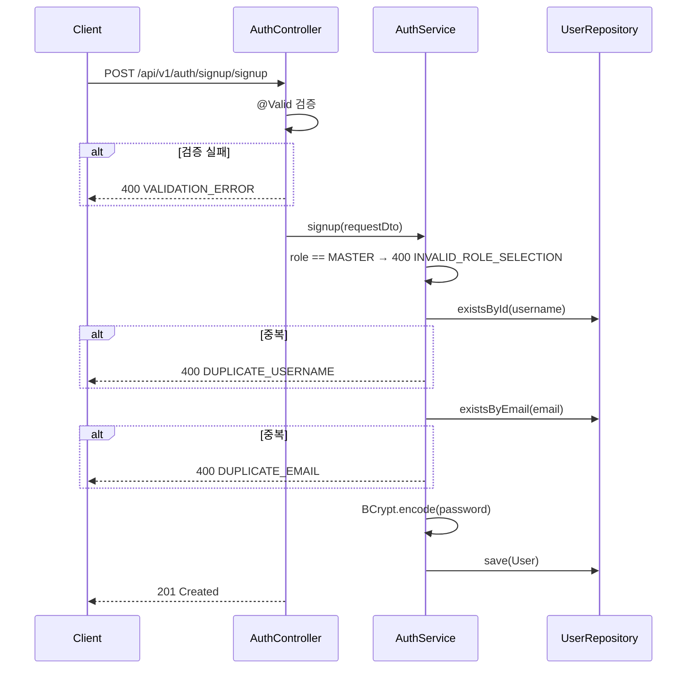

## 회원가입 

### 주요 로직
- 입력값 유효성 검증(@Valid)
- MASTER권한으로 회원가입 불가
- username, email 중복 검사
- 비밀번호 암호화

```mermaid
  sequenceDiagram
      participant C as Client
      participant AC as AuthController
      participant AS as AuthService
      participant DB as UserRepository

      C->>AC: POST /api/v1/auth/signup/signup
      AC->>AC: @Valid 검증
      alt 검증 실패
          AC-->>C: 400 VALIDATION_ERROR
      end

      AC->>AS: signup(requestDto)
      AS->>AS: role == MASTER → 400 INVALID_ROLE_SELECTION
      AS->>DB: existsById(username)
      alt 중복
          AS-->>C: 400 DUPLICATE_USERNAME
      end
      AS->>DB: existsByEmail(email)
      alt 중복
          AS-->>C: 400 DUPLICATE_EMAIL
      end
      AS->>AS: BCrypt.encode(password)
      AS->>DB: save(User)
      AC-->>C: 201 Created
```