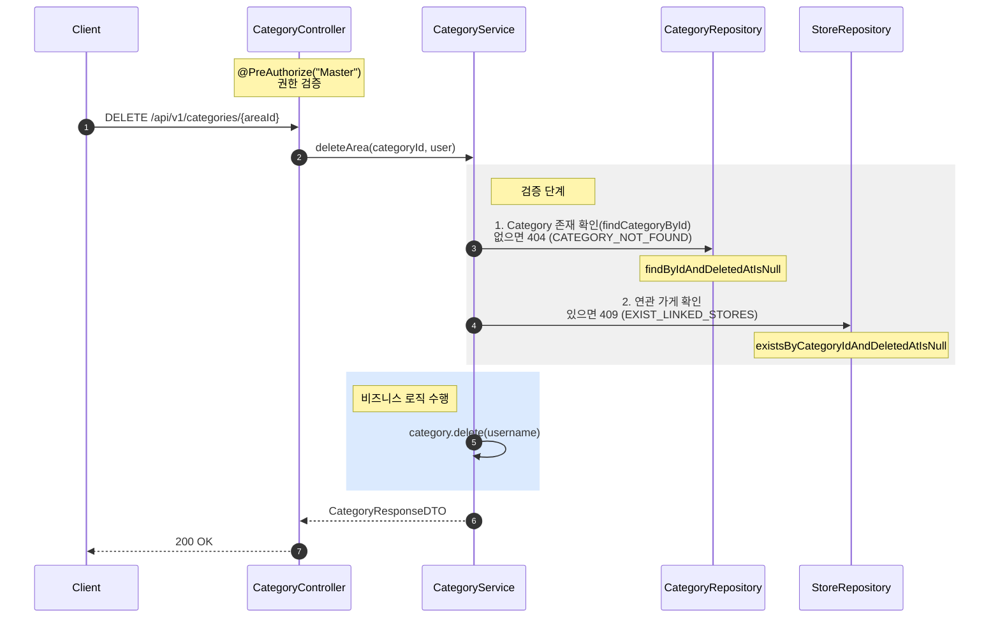

## 카테고리 삭제

**관련 도메인**: Category, Store  
**권한**: MASTER  

### 주요 흐름
- 카테고리 하위에 연관된 가게가 있으면 삭제 불가 (409 EXIST_LINKED_STORES)

```mermaid
sequenceDiagram
    autonumber
    participant Client
    participant Controller as CategoryController
    participant Service as CategoryService
    participant CategoryRepo as CategoryRepository
    participant StoreRepo as StoreRepository

    Note over Controller: @PreAuthorize("Master") <br/> 권한 검증

    Client->>Controller: DELETE /api/v1/categories/{areaId}
    Controller->>Service: deleteArea(categoryId, user)

  rect rgb(240, 240, 240)
    Note right of Service: 검증 단계
    Service->>CategoryRepo: 1. Category 존재 확인(findCategoryById) <br/> 없으면 404 (CATEGORY_NOT_FOUND)
    Note over CategoryRepo: findByIdAndDeletedAtIsNull
    Service->>StoreRepo: 2. 연관 가게 확인 <br/> 있으면 409 (EXIST_LINKED_STORES)
    Note over StoreRepo: existsByCategoryIdAndDeletedAtIsNull
  end

  rect rgb(219, 234, 254)
    Note left of Service: 비즈니스 로직 수행
    Service->>Service: category.delete(username)
  end

  Service-->>Controller: CategoryResponseDTO
  Controller-->>Client: 200 OK
```