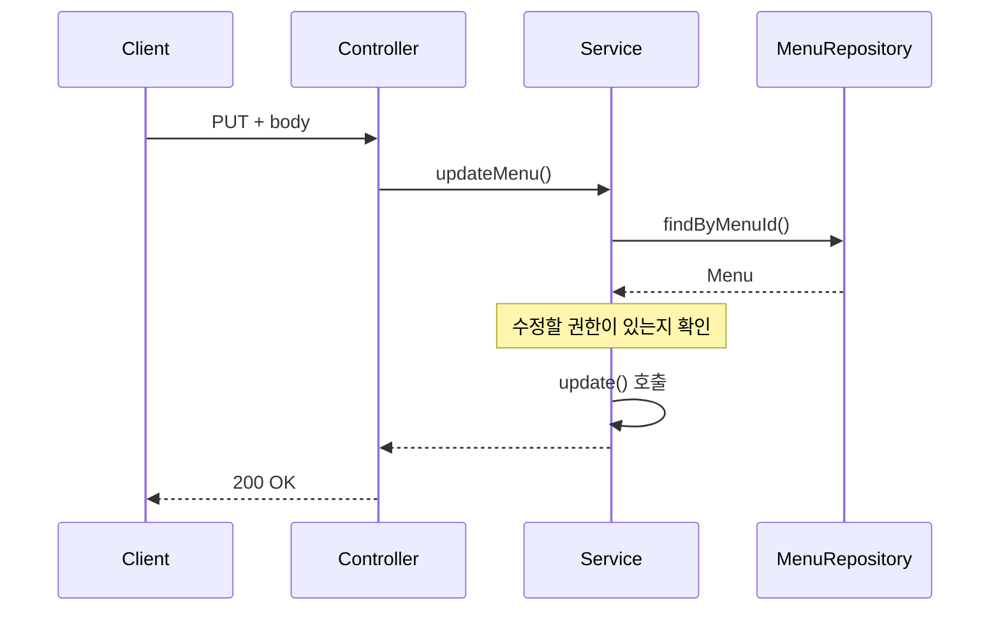

## 메뉴 수정
>메뉴 수정도 동일한 로직

```mermaid
sequenceDiagram
        participant Cla as Client
        participant Ctrl as Controller
        participant S as Service
        participant MR as MenuRepository

        Cla->>Ctrl: PUT + body
        Ctrl->>S: updateMenu()
        S->>MR: findByMenuId()
        MR-->>S: Menu
        Note over S: 수정할 권한이 있는지 확인
        S->>S: update() 호출
        S-->>Ctrl:
        Ctrl-->>Cla: 200 OK
```