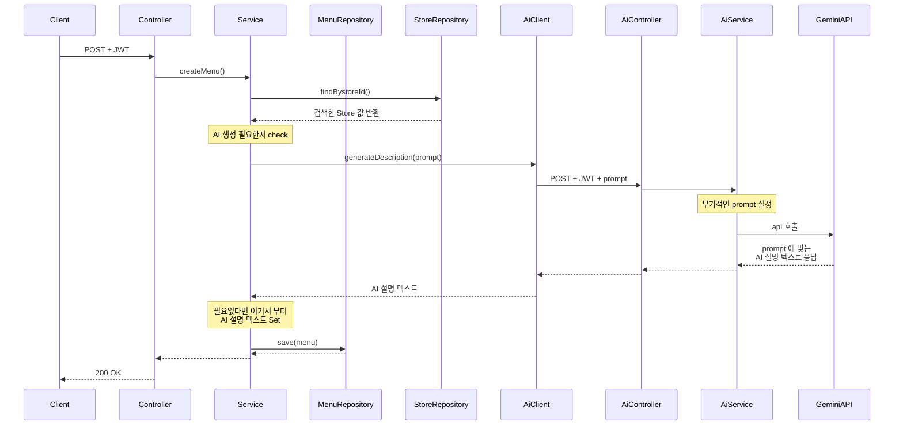

## 메뉴 생성
### 요약
> menuService -> aiClient -> aiService -> Gemini API 호출

```mermaid
sequenceDiagram
        participant Cla as Client
        participant Ctrl as Controller
        participant S as Service
        participant MR as MenuRepository
        participant SR as StoreRepository
        participant ACla as AiClient
        participant ACtrl as AiController
        participant AS as AiService
        participant api as GeminiAPI

        Cla->>Ctrl: POST + JWT
        Ctrl->>S: createMenu()
        S->>SR: findBystoreId()
        SR-->>S: 검색한 Store 값 반환
        Note over S: AI 생성 필요한지 check
        S->>ACla: generateDescription(prompt)
        ACla->>ACtrl:POST + JWT + prompt
        ACtrl->>AS: 
        Note over AS: 부가적인 prompt 설정
        AS->>api: api 호출
        api-->>AS: prompt 에 맞는 <br> AI 설명 텍스트 응답
        AS-->>ACtrl:
        ACtrl-->>ACla:
        ACla-->>S:AI 설명 텍스트
        Note over S: 필요없다면 여기서 부터 <br> AI 설명 텍스트 Set
        S->>MR:save(menu)
        MR-->>S:
        S-->>Ctrl:
        Ctrl-->>Cla: 200 OK
```