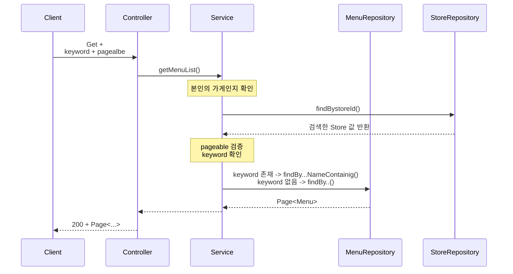

## 메뉴 리스트 조회

```mermaid
sequenceDiagram
        participant Cla as Client
        participant Ctrl as Controller
        participant S as Service
        participant MR as MenuRepository
        participant SR as StoreRepository

        Cla->>Ctrl: Get + <br> keyword + pagealbe
        Ctrl->>S: getMenuList()
        Note over S: 본인의 가게인지 확인
        S->>SR: findBystoreId()
        SR-->>S: 검색한 Store 값 반환
        Note over S: pageable 검증 <br> keyword 확인
        S->>MR: keyword 존재 -> findBy...NameContainig() <br> keyword 없음 -> findBy..()
        MR-->>S:Page<Menu>
        S-->>Ctrl:
        Ctrl-->>Cla:200 + Page<...>
```