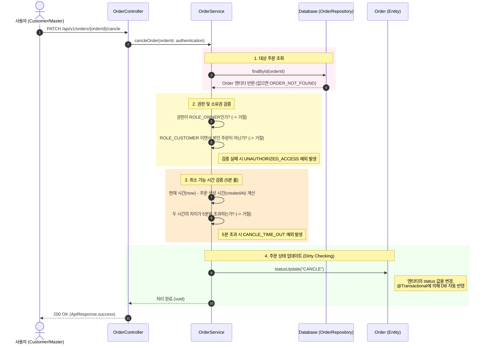

## 주문 취소
**권한**: CUSTOMER, MASTER

**관련 도메인**: `public void cancelOrder(UUID orderId,String username, UserRole role)`


### 발생된 문제점

- 주문 생성 후 5분 이내에만 취소가 가능하도록 하는 기능을 구현하던 중, 현재 시간과 주문 생성 시간(`createdAt`)의 차이를 계산하기 위해 다음과 같이 코드를 작성
```java
//주문 취소 요청 시 현재 시간을 가져온다.
LocalDateTime now =  LocalDateTime.now();
//취소할 주문 건의 주문 생성 시간
LocalDateTime orderTime = cancleOrder.getCreatedAt(); //cancelOrder = 주문 취소하려는 Order

// 발생한 문제의 코드: 5분(300초) 초과 여부 확인 시도
if (now - createdAt > 300) { 
    throw new IllegalStateException("주문 생성 후 5분이 지나 취소할 수 없습니다.");
}
```
- **발생한 에러** : ```Error: Operator '-' cannot be applied to 'java.time.LocalDateTime', 'java.time.LocalDateTime'```

### 원인

1. **자바의 연산자 제한** : 자바의 산술 연산자는 오직 기본 타입과 `String`에 대해서만 작동.
2. **객체 간 연산 불가** : ```LocalDateTime```은 클래스이므로 산술 연산자를 직접 사용할 수 없음.
3. **언어적 특성 오해** : `Python`은 연산자 오버로딩을 지원하는 언어와 달리, `Java`는 연산자 오버로딩을 지원하지 않아 객체 간의 직접적인 산술 연산이 불가능함.

### 해결방안

- ```now```와 ```orderTime```의 시간적 차이, 즉 "얼마나 걸렸는가?"를 계산해야 하므로 나노초까지 계산할 수 있는 ```java.time.Duration```을 사용
- 해결 예시. 
```java
    @Transactional
public void cancelOrder(UUID orderId,String username, UserRole role){
    ...
    //로직 수행 : 주문 생성 시, 5분이내에만 주문 취소가 가능하다.

    //주문 취소 요청 시 현재 시간을 가져온다.
    LocalDateTime now =  LocalDateTime.now();
    //취소할 주문 건의 주문 생성 시간
    LocalDateTime orderTime = cancelOrder.getCreatedAt();

    //now와 orderTime의 차이를 시,분,초로 계산한다.
    Duration duration = Duration.between(orderTime,now);

    //전체 차이를 분 단위로 변환하여, 5보다 클 경우 예외를 던진다.
    if(duration.toMinutes() > 5) {
        throw new CustomException(ErrorCode.CANCEL_TIME_OUT);
    }
    String status = "CANCEL";
    //모든 단계를 통과하면, 정상적으로 주문 상태를 취소 상태로 변경한다.
    cancelOrder.statusUpdate(status);
}
```

### 주문취소 시퀀스 다이어 그램
