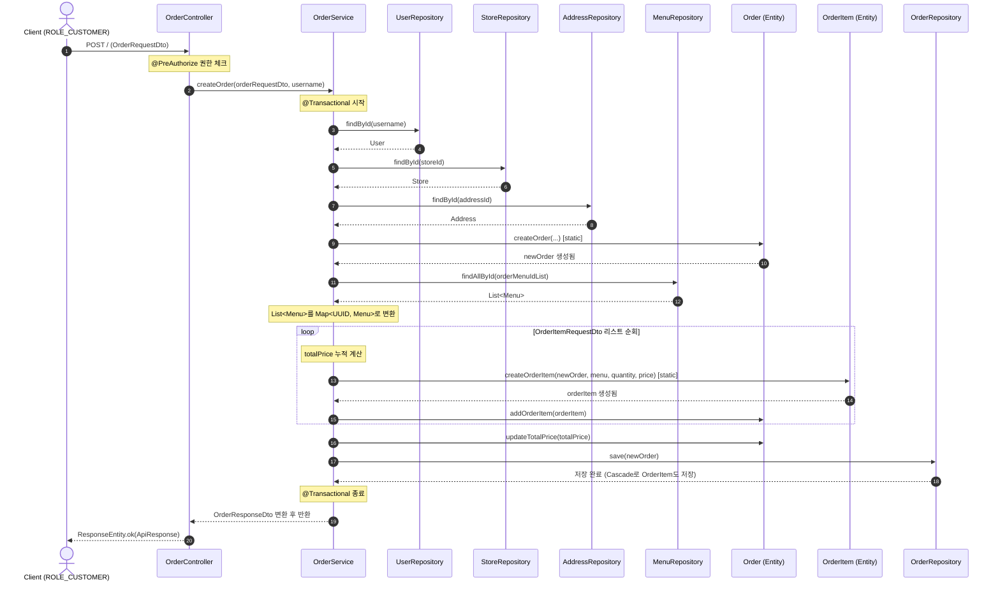

## 주문 생성

**권한**: CUSOTMER
**관련 도메인**: `public OrderResponseDto createOrder(OrderRequestDto orderRequestDto, String username)`

### 발생된 문제점
- **분리된 트랜잭션에 따른 데이터 정합성 문제**
  - 주문 생성 시, `Controller`에서 `OrderService`와 `OrderItemService`를 각각 호출 하여, 주문을 생성하고 주문 메뉴를 생성하도록 함.
  - 이는 주문 생성 직후, 가게 주인이 메뉴를 숨김 처리를 해버린다면 주문 메뉴 테이블에는 주문 생성 테이블과 다른 데이터가 담겨질 수도 있다는 것을
  - Postman으로 확인함.(OrderItemService에 의도적으로 예외를 발생시킴.)
- **불필요한 반복적 DB 접근 (N+1 문제)**
  - `Order` 객체 생성 시 총 주문 가격(`totalPrice`)을 계산하기 위해, 주문 메뉴 항목(`items`)을 순회하며 매번 `p_menu` 테이블에 개별적으로 `Select` 쿼리를 실행함.
  - 주문 항목의 개수(N)만큼 DB 커넥션을 점유하게 되어 시스템 부하와 성능 저하의 주원인이 됨
  - 이는 결국 **$O(N \times M)$**의 시간 복잡도가 발생함.


### 해결방안
- 주문 요청된 `OrderRequestDto`에서 `menuId`를 추출하여 `findAllById()`로 메뉴 리스트를 일괄 조회.
- 조회된 메뉴 리스트를 Map으로 변환.(`key = menuId`, `value = menu`)
- 주문 메뉴 항목(`items`)를 순회하며, 변환된 메뉴 Map 객체를 `menuMap.get(menuId)`를 통해 메뉴 정보를 즉시 획득하고, 총액을 합산.
- 또한 이를 재사용하여, 주문 메뉴도 같이 생성.
- 주문을 생성하면, 주문 메뉴또한 같이 만들기 위해 Order 엔티티에 Cascade.ALL을 선언하여, 같은 영속성 컨텍스트를 사용하도록 함.
- 해결 예시
```java
   @Transactional
public OrderResponseDto createOrder(OrderRequestDto orderRequestDto, String username) {
  // user 정보 가져옴.
  User orderUser = userRepository.findById(username)
          .orElseThrow(() -> new CustomException(ErrorCode.USER_NOT_FOUND));
  //store 정보 가져옴.
  Store orderStore = storeRepository.findById(orderRequestDto.getStoreId())
          .orElseThrow(() -> new CustomException(ErrorCode.STORE_NOT_FOUND));
  //address 정보 가져옴.
  Address orderAddress = addressRepository.findById(orderRequestDto.getAddressId())
          .orElseThrow(() -> new CustomException(ErrorCode.ADDRESS_NOT_FOUND));

  // 총 주문 금액.
  Integer totlaPrice = 0;

  //Db에 저장 시킬 Order를 미리 만듦.
  Order newOrder = Order.createOrder(orderUser, orderStore, orderAddress,
          orderRequestDto.getOrderType(), totlaPrice, orderRequestDto.getRequest());

  //OrderRequestDto에서 OrderItemReqestDto를 꺼낸다.
  List<OrderItemRequestDto> orderItemsList = orderRequestDto.getItems();

  //OrderItemList에서 menuId를 가져와 리스트로 만든다.
  List<UUID> orderMenuIdList = orderItemsList.stream().map(OrderItemRequestDto::getMenuId)
          .collect(Collectors.toList());

  //가져온 menuId 전부를 DB에서 호출하여 Menu 리스트를 가져온다.
  List<Menu> orderMenuList = menuRepository.findAllById(orderMenuIdList);

  //이 Menu 리스트를 map으로 변환한다.
  Map<UUID, Menu> orderMenuMap = new HashMap<>();
  for (Menu menu : orderMenuList) {
    orderMenuMap.put(menu.getMenuId(), menu);
  }

  //이렇게 만든 Menu와 OrderItemRequestDto를 가지고, totalPrice와 OrderItem을 만들고 , Order에 저장한다.
  for (OrderItemRequestDto orderItemReq : orderItemsList) {
    // totalPrice를 계산한다.
    Menu orderMenu = orderMenuMap.get(orderItemReq.getMenuId());
    totlaPrice += orderMenu.getPrice() * orderItemReq.getQuantity();

    OrderItem orderItem = OrderItem.createOrderItem(newOrder, orderMenu, orderItemReq.getQuantity(), orderMenu.getPrice());
    newOrder.addOrderItem(orderItem);
  }
  newOrder.updateTotalPrice(totlaPrice);
  orderRepository.save(newOrder);

  return  OrderResponseDto.from(newOrder);
}
```


### 주문생성 시퀀스 다이어그램


