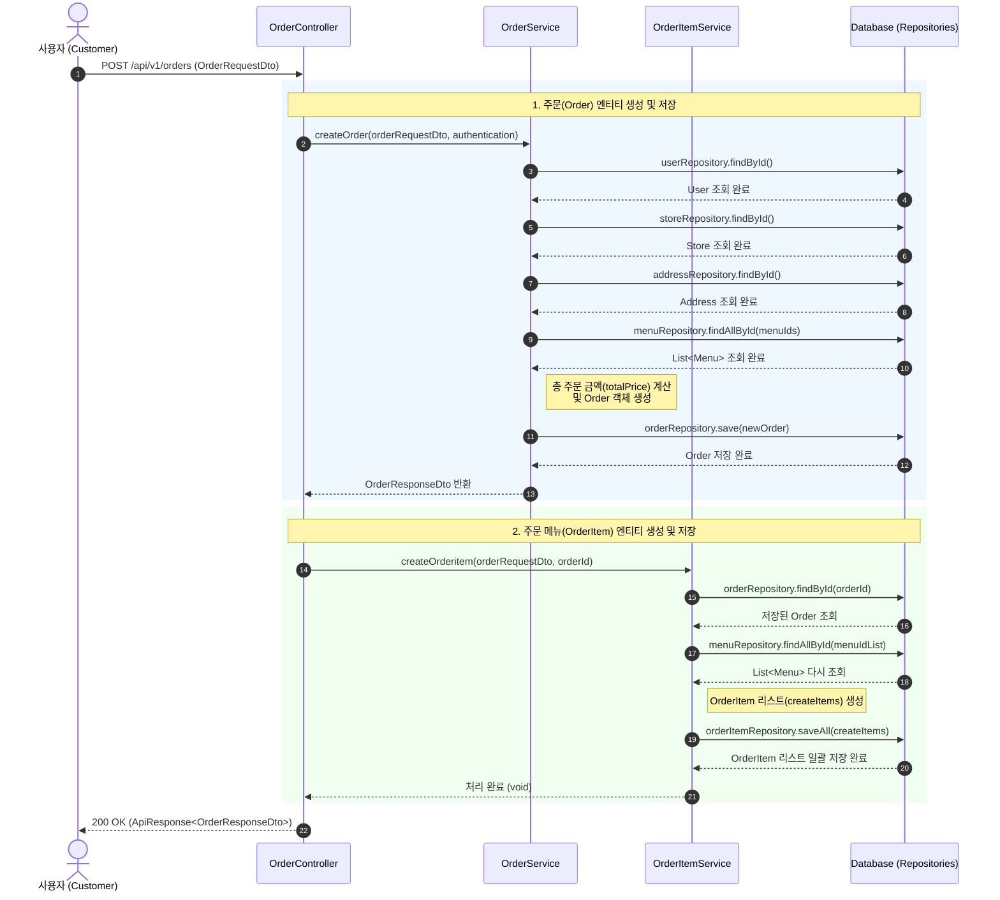

## 주문 생성

**권한**: CUSOTMER
**관련 도메인**: `public OrderResponseDto createOrder(OrderRequestDto orderRequestDto, String username)`

### 발생된 문제점

- **불필요한 반복적 DB 접근 (N+1 문제)** 
  - `Order` 객체 생성 시 총 주문 가격(`totalPrice`)을 계산하기 위해, 주문 메뉴 항목(`items`)을 순회하며 매번 `p_menu` 테이블에 개별적으로 `Select` 쿼리를 실행함.
  - 주문 항목의 개수(N)만큼 DB 커넥션을 점유하게 되어 시스템 부하와 성능 저하의 주원인이 됨
- **비효율적인 탐색 알고리즘** 
  - `findAllById()`로 메뉴 목록을 한 번에 조회하더라도, 주문 항목 리스트와 메뉴 리스트를 단순 이중 `for문`으로 비교할 경우 **$O(N \times M)$**의 시간 복잡도가 발생함.
  - 데이터 양이 많아질수록 주문 처리 속도가 기하급수적으로 느려질 위험이 있음.

### 해결방안

- 주문 요청된 `OrderRequestDto`에서 `menuId`를 추출하여 `findAllById()`로 메뉴 리스트를 일괄 조회. 
- 조회된 메뉴 리스트를 Map으로 변환.(`key = menuId`, `value = menu`)
- 주문 메뉴 항목(`items`)를 순회하며, 변환된 메뉴 Map 객체를 `menuMap.get(menuId)`를 통해 메뉴 정보를 즉시 획득하고, 총액을 합산.
- 해결 예시
```java
  @Transactional
    public OrderResponseDto createOrder(OrderRequestDto orderRequestDto, String username) {

        ...

        // 생성할 주문 데이터 안에서 생성할 주문 메뉴 리스트를 추출.
        List<OrderItemRequestDto> items = orderRequestDto.getItems();

        // 주문 메뉴 리스트에서 menuId만 추출.
        List<UUID> menuIds = items.stream()
            .map(OrderItemRequestDto::getMenuId)
            .toList();

        // N개의 menuId를 DB에 요청하여 N개의 메뉴 리스트를 조회 - 안에 금액이 들어있음.
        List<Menu> menus = menuRepository.findAllById(menuIds);

        // 내부적으로 이중for문을 피하기 위해 메뉴 리스트를 map으로 변환.
        Map<UUID,Menu> menuMap = new HashMap<>();
        for (Menu menu : menus) {
            menuMap.put(menu.getMenuId(), menu);
        }

        // 총 주문 금액을 계산하기 위한 변수.
        Integer totalPrice = 0;

        //생성할 주문메뉴 리스트를 순회하면서
        for (OrderItemRequestDto item : items) {

            //메뉴 리스트 중 1개를 뽑아서
            Menu orderedMenu = menuMap.get(item.getMenuId());

            // 메뉴별 가격 * 수량을 계산하여 총 주문 금액을 계산한다.
            totalPrice += orderedMenu.getPrice() * item.getQuantity();
        }

        // 새로운 Order 객체로 변환
        Order newOrder = Order.createOrder(user
            ,store
            ,address
            ,orderRequestDto.getOrderType()
            ,totalPrice
            ,orderRequestDto.getRequest());

        orderRepository.save(newOrder);
        return OrderResponseDto.from(newOrder);
    }
```


### 주문생성 시퀀스 다이어그램


