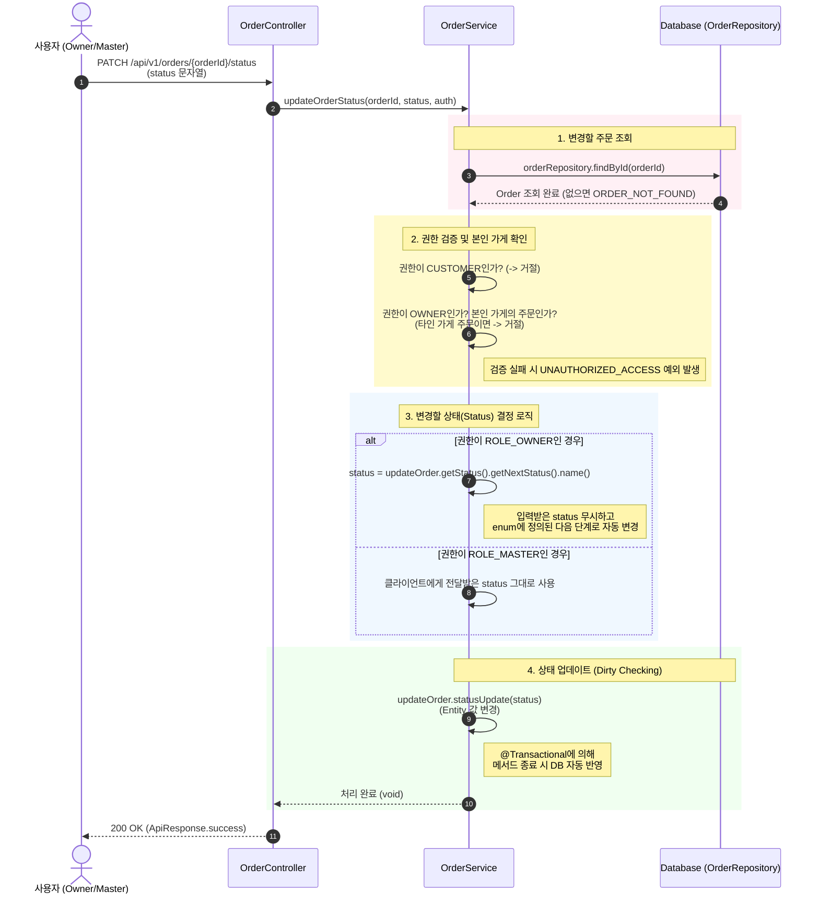

## 주문 상태 변경
- **권한**: OWNER, MASTER

- **관련 도메인** :  `public void updateOrderStatus(UUID orderId, String status, String username, UserRole role)`

### 발생된 문제점

- 클라이언트에서 API 호출 시 임의의 상태 값을 전달할 경우, 필수적인 배달 프로세스(대기 -> 수락 -> 조리 등)가 무시될 위험이 존재함 
- 예: 주문 대기(`PENDING`) 상태에서 갑자기 배달 완료(`DELIVERED`) 상태로 건너뛰는 등 무분별한 오류가 발생하여 데이터의 무결성이 훼손될 수 있음.

### 원인

- 해당 API는 관리자(MASTER)와 가게 사장(OWNER)이 공통으로 사용함.
- 관리자(MASTER)는 CS 처리 등 운영상 임의의 상태 변경이 필요하여 클라이언트로부터 상태값을 전달받아 반영해야 함.
- 하지만 사장(OWNER)은 반드시 정해진 순서대로만 상태를 변경해야 하는데, 이를 하나의 API에서 단순 if-else문으로 검증하려다 보면 서비스 로직이 방대해지고 비즈니스 규칙이 파편화되는 문제가 발생함.

### 해결방안

- **Enum을 활용한 상태 값 제어** 
  - `OrderStatus` `Enum` 내부에 `getNextStatus()` 메서드를 구현하여, 상태 전이 규칙을 설정함.
  - 현재 주문 상태 값을 기준으로 `switch문`을 활용해 정해진 다음 단계의 상태 값을 반환하도록 설계함.
- **@AuthenticationPrincipal을 활용한 권한별 제어 로직 강제화**
  - `Controller` 단계에서 `@AuthenticationPrincipal` 어노테이션으로 로그인한 사용자의 정보를 추출해 `Service` 메서드로 전달함.
  - Service 계층에서 사용자 권한(Role)을 확인하여 업데이트 방식을 명확히 분리함.
    - **OWNER인 경우**: 클라이언트가 보낸 상태값을 무시하고, `getNextStatus()`를 호출하여 반환된 값으로 덮어씌워 강제 순차 전이를 보장함.
    - **MASTER인 경우**: 예외적으로 클라이언트에서 전달받은 `status` 값을 그대로 사용하여 즉각적인 상태 업데이트를 허용함.

```java
    @Transactional
    public void updateOrderStatus(UUID orderId, String status, String username, UserRole role){
        //변경할 현재 Order를 가져온다.
        Order updateOrder = orderRepository.findById(orderId).orElseThrow(()->new CustomException(ErrorCode.ORDER_NOT_FOUND));

        // 사용자 권한이 가게 주인이지만, 다른 사람 주문에 접근했을 때에만 접근 제한을 설정한다.
        if(role == UserRole.OWNER &&(!username.equals(updateOrder.getStore().getOwner().getUsername()))){
            throw new CustomException(ErrorCode.UNAUTHORIZED_ACCESS);
        }
        // 다음 사용자 권한이 가게 주인일 때만, 순차적으로 주문 상태를 변경 시켜 status에 저장한다.
        if(role == UserRole.OWNER) {
            status = updateOrder.getStatus().getNextStatus().name();
        }

        // 마스터 일 때는 전달 받은 status를 그대로 사용한다.
        updateOrder.statusUpdate(status);
    }

public enum OrderStatus {
    CANCEL, PENDING, ACCEPTED, COOKING, DELIVERING, DELIVERED, COMPLETED;

    // OWNER가 변경 가능한 다음 상태를 반환하는 메서드
    public OrderStatus getNextStatus() {
        return switch (this) {
            case PENDING -> ACCEPTED;    // 주문요청 -> 주문수락
            case ACCEPTED -> COOKING;    // 주문수락 -> 조리중(완료)
            case COOKING -> DELIVERING;  // 조리완료 -> 배송중
            case DELIVERING -> DELIVERED;// 배송중 -> 배송완료
            case DELIVERED -> COMPLETED; // 배송완료 -> 주문완료
            default -> this;             // CANCLE 이나 COMPLETED 상태에선 변경 불가
        };
    }
}
```

### 주문 상태 변경 시퀀스 다이어그램
