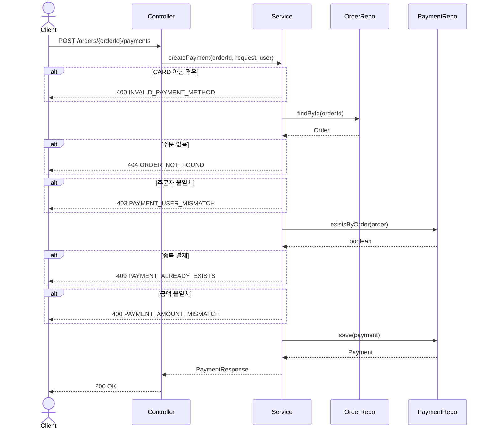

## 결제 처리 API

**Endpoint**: `POST /api/v1/orders/{orderId}/payments`  
**권한**: 인증된 사용자  
**설명**: 주문에 대한 결제 처리

```mermaid
sequenceDiagram
    actor Client
    participant Controller
    participant Service
    participant OrderRepo
    participant PaymentRepo

    Client->>Controller: POST /orders/{orderId}/payments
    Controller->>Service: createPayment(orderId, request, user)

    alt CARD 아닌 경우
        Service-->>Client: 400 INVALID_PAYMENT_METHOD
    end

    Service->>OrderRepo: findById(orderId)
    OrderRepo-->>Service: Order

    alt 주문 없음
        Service-->>Client: 404 ORDER_NOT_FOUND
    end

    alt 주문자 불일치
        Service-->>Client: 403 PAYMENT_USER_MISMATCH
    end

    Service->>PaymentRepo: existsByOrder(order)
    PaymentRepo-->>Service: boolean

    alt 중복 결제
        Service-->>Client: 409 PAYMENT_ALREADY_EXISTS
    end

    alt 금액 불일치
        Service-->>Client: 400 PAYMENT_AMOUNT_MISMATCH
    end

    Service->>PaymentRepo: save(payment)
    PaymentRepo-->>Service: Payment

    Service-->>Controller: PaymentResponse
    Controller-->>Client: 200 OK
```