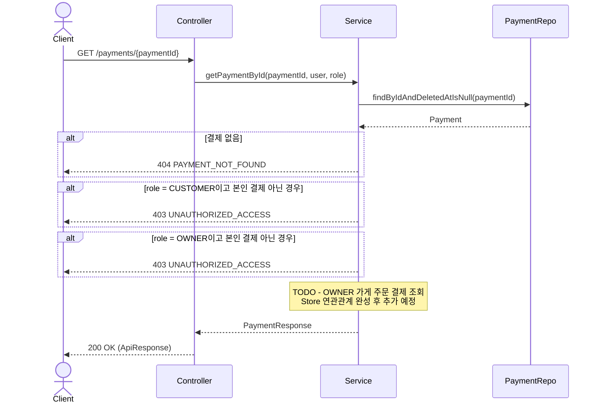

## 결제 상세 조회 API

**Endpoint**: `GET /api/v1/payments/{paymentId}`  
**권한**: 인증된 사용자  
**설명**: 결제 단건 조회 (role에 따라 접근 범위 다름)

```mermaid
sequenceDiagram
    actor Client
    participant Controller
    participant Service
    participant PaymentRepo

    Client->>Controller: GET /payments/{paymentId}
    Controller->>Service: getPaymentById(paymentId, user, role)

    Service->>PaymentRepo: findByIdAndDeletedAtIsNull(paymentId)
    PaymentRepo-->>Service: Payment

    alt 결제 없음
        Service-->>Client: 404 PAYMENT_NOT_FOUND
    end

    alt role = CUSTOMER이고 본인 결제 아닌 경우
        Service-->>Client: 403 UNAUTHORIZED_ACCESS
    end

    alt role = OWNER이고 본인 결제 아닌 경우
        Service-->>Client: 403 UNAUTHORIZED_ACCESS
    end

    Note over Service: TODO - OWNER 가게 주문 결제 조회<br/>Store 연관관계 완성 후 추가 예정

    Service-->>Controller: PaymentResponse
    Controller-->>Client: 200 OK (ApiResponse)
```