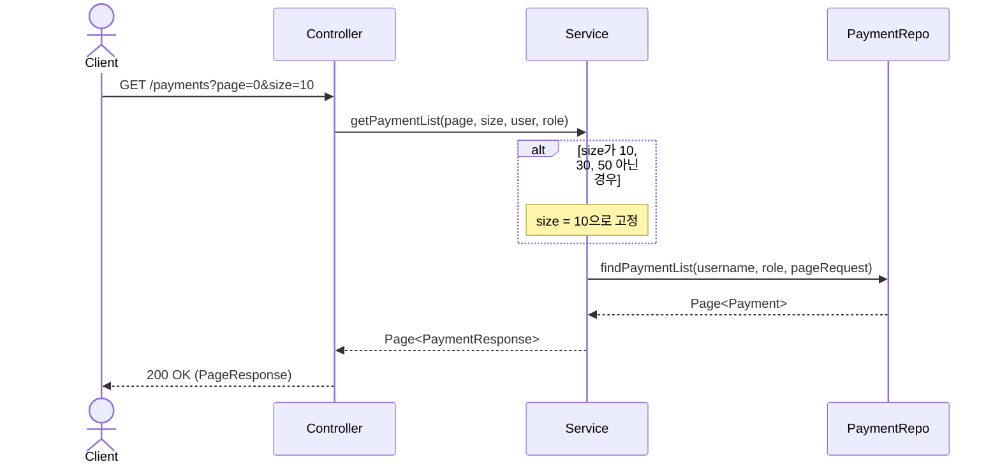

## 결제 목록 조회 API

**Endpoint**: `GET /api/v1/payments`  
**권한**: 인증된 사용자  
**설명**: 결제 목록 조회 (role에 따라 조회 범위 다름)

```mermaid
sequenceDiagram
    actor Client
    participant Controller
    participant Service
    participant PaymentRepo

    Client->>Controller: GET /payments?page=0&size=10
    Controller->>Service: getPaymentList(page, size, user, role)

    alt size가 10, 30, 50 아닌 경우
        Note over Service: size = 10으로 고정
    end

    Service->>PaymentRepo: findPaymentList(username, role, pageRequest)
    PaymentRepo-->>Service: Page<Payment>

    Service-->>Controller: Page<PaymentResponse>
    Controller-->>Client: 200 OK (PageResponse)
```