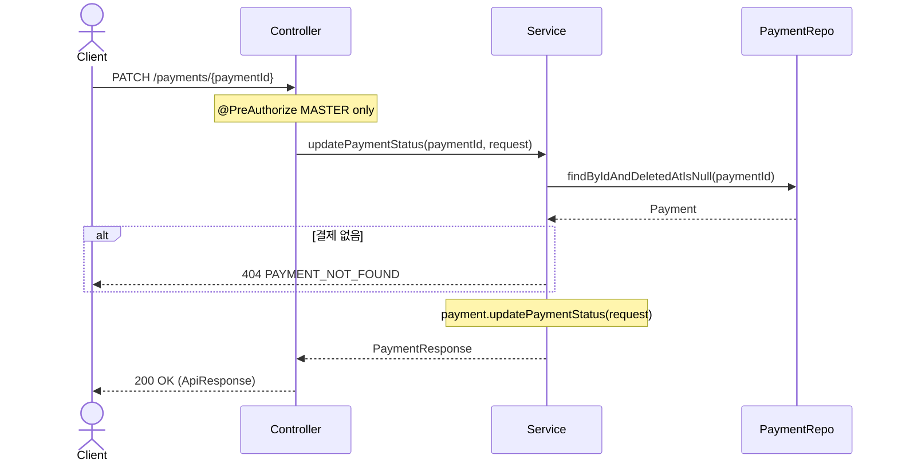

## 결제 상태 수정 API

**Endpoint**: `PATCH /api/v1/payments/{paymentId}`  
**권한**: MASTER  
**설명**: 결제 상태 수정

```mermaid
sequenceDiagram
    actor Client
    participant Controller
    participant Service
    participant PaymentRepo

    Client->>Controller: PATCH /payments/{paymentId}
    Note over Controller: @PreAuthorize MASTER only

    Controller->>Service: updatePaymentStatus(paymentId, request)

    Service->>PaymentRepo: findByIdAndDeletedAtIsNull(paymentId)
    PaymentRepo-->>Service: Payment

    alt 결제 없음
        Service-->>Client: 404 PAYMENT_NOT_FOUND
    end

    Note over Service: payment.updatePaymentStatus(request)

    Service-->>Controller: PaymentResponse
    Controller-->>Client: 200 OK (ApiResponse)
```