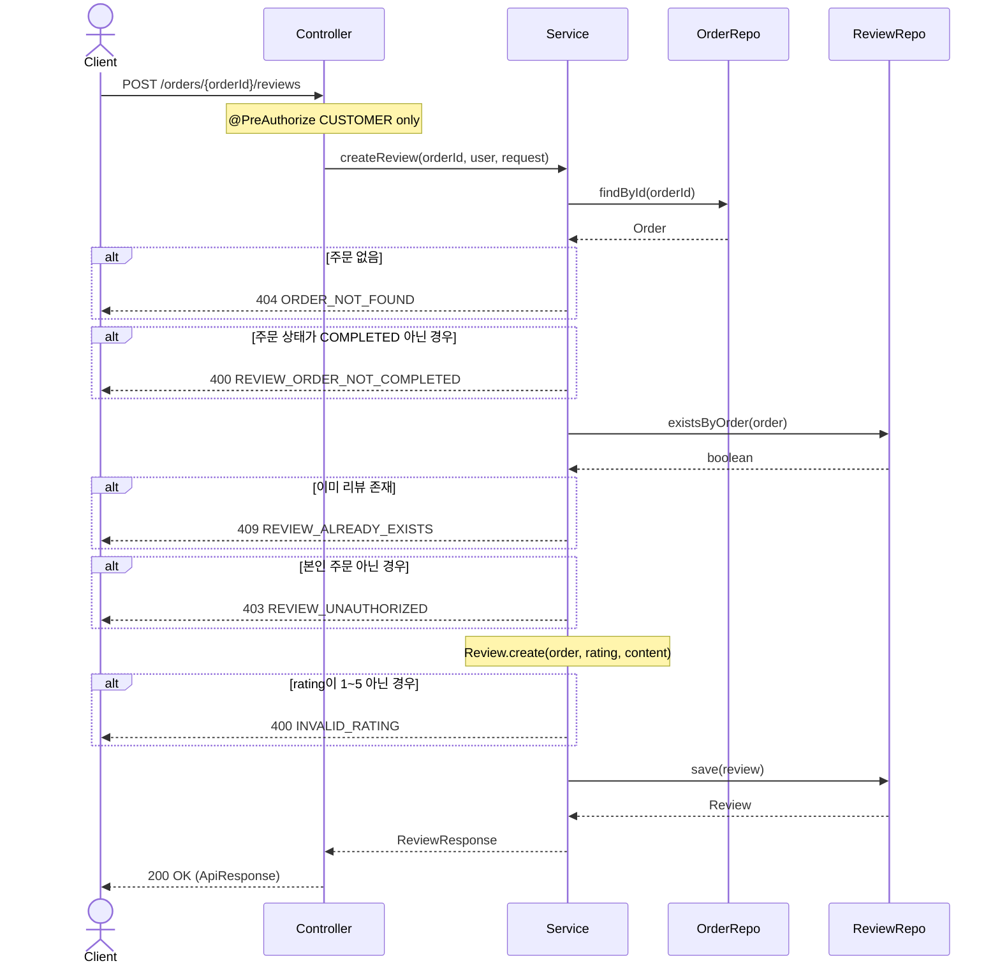

## 리뷰 등록 API

**Endpoint**: `POST /api/v1/orders/{orderId}/reviews`  
**권한**: CUSTOMER  
**설명**: 완료된 주문에 대해 리뷰 등록

```mermaid
sequenceDiagram
    actor Client
    participant Controller
    participant Service
    participant OrderRepo
    participant ReviewRepo

    Client->>Controller: POST /orders/{orderId}/reviews
    Note over Controller: @PreAuthorize CUSTOMER only

    Controller->>Service: createReview(orderId, user, request)

    Service->>OrderRepo: findById(orderId)
    OrderRepo-->>Service: Order

    alt 주문 없음
        Service-->>Client: 404 ORDER_NOT_FOUND
    end

    alt 주문 상태가 COMPLETED 아닌 경우
        Service-->>Client: 400 REVIEW_ORDER_NOT_COMPLETED
    end

    Service->>ReviewRepo: existsByOrder(order)
    ReviewRepo-->>Service: boolean

    alt 이미 리뷰 존재
        Service-->>Client: 409 REVIEW_ALREADY_EXISTS
    end

    alt 본인 주문 아닌 경우
        Service-->>Client: 403 REVIEW_UNAUTHORIZED
    end

    Note over Service: Review.create(order, rating, content)

    alt rating이 1~5 아닌 경우
        Service-->>Client: 400 INVALID_RATING
    end

    Service->>ReviewRepo: save(review)
    ReviewRepo-->>Service: Review

    Service-->>Controller: ReviewResponse
    Controller-->>Client: 200 OK (ApiResponse)
```