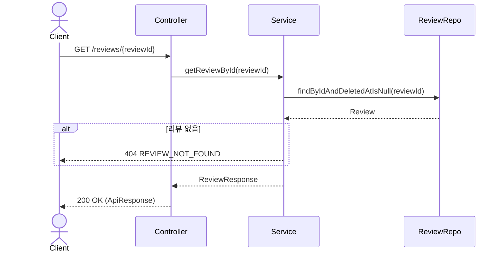

## 리뷰 상세 조회 API

**Endpoint**: `GET /api/v1/reviews/{reviewId}`  
**권한**: 전체  
**설명**: 리뷰 단건 조회

```mermaid
sequenceDiagram
    actor Client
    participant Controller
    participant Service
    participant ReviewRepo

    Client->>Controller: GET /reviews/{reviewId}
    Controller->>Service: getReviewById(reviewId)

    Service->>ReviewRepo: findByIdAndDeletedAtIsNull(reviewId)
    ReviewRepo-->>Service: Review

    alt 리뷰 없음
        Service-->>Client: 404 REVIEW_NOT_FOUND
    end

    Service-->>Controller: ReviewResponse
    Controller-->>Client: 200 OK (ApiResponse)
```