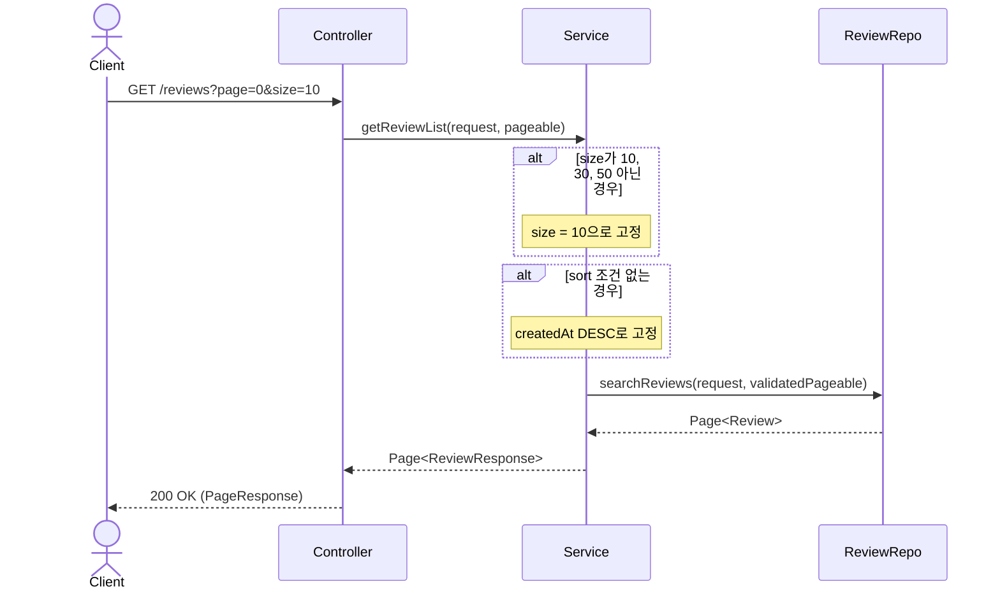

## 리뷰 목록 조회 API

**Endpoint**: `GET /api/v1/reviews`  
**권한**: 전체  
**설명**: 검색 조건으로 리뷰 목록 조회

```mermaid
sequenceDiagram
    actor Client
    participant Controller
    participant Service
    participant ReviewRepo

    Client->>Controller: GET /reviews?page=0&size=10
    Controller->>Service: getReviewList(request, pageable)

    alt size가 10, 30, 50 아닌 경우
        Note over Service: size = 10으로 고정
    end

    alt sort 조건 없는 경우
        Note over Service: createdAt DESC로 고정
    end

    Service->>ReviewRepo: searchReviews(request, validatedPageable)
    ReviewRepo-->>Service: Page<Review>

    Service-->>Controller: Page<ReviewResponse>
    Controller-->>Client: 200 OK (PageResponse)
```