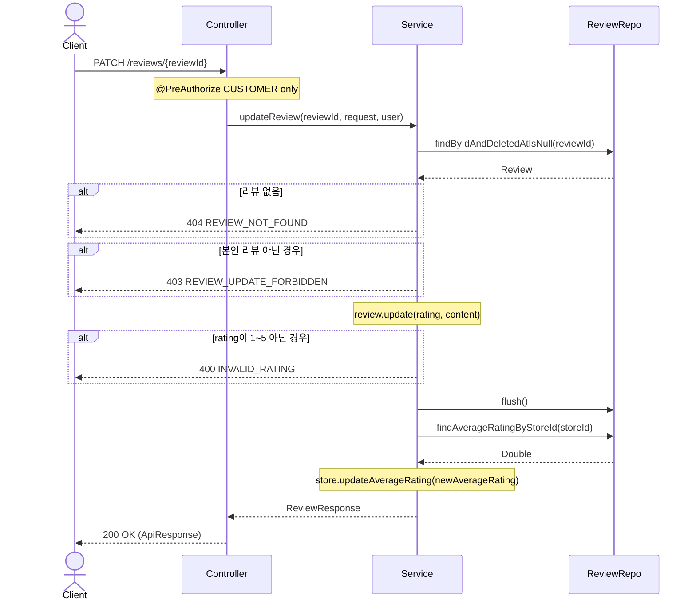

## 리뷰 수정 API

**Endpoint**: `PATCH /api/v1/reviews/{reviewId}`  
**권한**: CUSTOMER  
**설명**: 본인 리뷰 수정

```mermaid
sequenceDiagram
    actor Client
    participant Controller
    participant Service
    participant ReviewRepo

    Client->>Controller: PATCH /reviews/{reviewId}
    Note over Controller: @PreAuthorize CUSTOMER only

    Controller->>Service: updateReview(reviewId, request, user)

    Service->>ReviewRepo: findByIdAndDeletedAtIsNull(reviewId)
    ReviewRepo-->>Service: Review

    alt 리뷰 없음
        Service-->>Client: 404 REVIEW_NOT_FOUND
    end

    alt 본인 리뷰 아닌 경우
        Service-->>Client: 403 REVIEW_UPDATE_FORBIDDEN
    end

    Note over Service: review.update(rating, content)

    alt rating이 1~5 아닌 경우
        Service-->>Client: 400 INVALID_RATING
    end

    Service->>ReviewRepo: flush()

    Service->>ReviewRepo: findAverageRatingByStoreId(storeId)
    ReviewRepo-->>Service: Double

    Note over Service: store.updateAverageRating(newAverageRating)

    Service-->>Controller: ReviewResponse
    Controller-->>Client: 200 OK (ApiResponse)
```