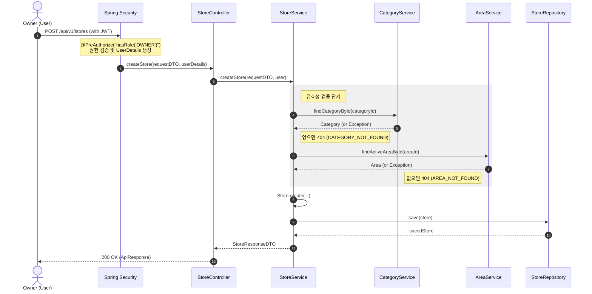

## 가게 생성

**관련 도메인**: Store, Category, Area  
**권한**: OWNER
### 주요 흐름
- OWNER 권한 체크 후 Category, Area 유효성 확인
- 둘 다 통과 시 가게 저장

```mermaid
sequenceDiagram
    autonumber
    actor Owner as Owner (User)
    participant Global as Spring Security
    participant Controller as StoreController
    participant Service as StoreService
    participant CategorySvc as CategoryService
    participant AreaSvc as AreaService
    participant Repository as StoreRepository

    Owner->>Global: POST /api/v1/stores (with JWT)
    Note over Global: @PreAuthorize("hasRole('OWNER')") <br/> 권한 검증 및 UserDetails 생성

    Global->>Controller: createStore(requestDTO, userDetails)

    Controller->>Service: createStore(requestDTO, user)

    rect rgb(240, 240, 240)
        Note right of Service: 유효성 검증 단계
        Service->>CategorySvc: findCategoryById(categoryId)
        CategorySvc-->>Service: Category (or Exception)
        Note left of CategorySvc: 없으면 404 (CATEGORY_NOT_FOUND)
        Service->>AreaSvc: findActiveAreaById(areaId)
        AreaSvc-->>Service: Area (or Exception)
        Note left of AreaSvc: 없으면 404 (AREA_NOT_FOUND)
    end

    Service->>Service: Store.create(...)

    Service->>Repository: save(store)
    Repository-->>Service: savedStore

    Service-->>Controller: StoreResponseDTO
    Controller-->>Owner: 200 OK (ApiResponse)
```