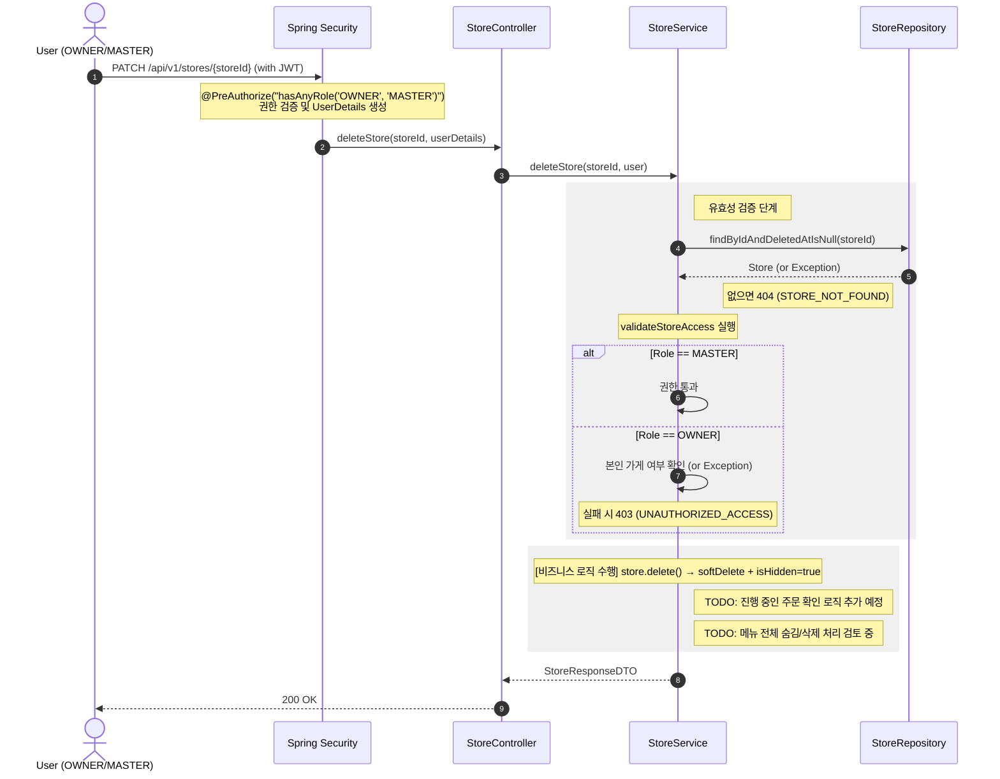

## 가게 삭제

**관련 도메인**: Store
**권한**: OWNER, MASTER
### 주요 흐름
- User 권한 체크 후 Soft Delete 처리 및 상태(isHdden -> true) 변경  
- **todo** 완료되지 않은 주문 건이 있을 경우 예외처리

```mermaid
sequenceDiagram

    autonumber
    actor User as User (OWNER/MASTER)
    participant Global as Spring Security
    participant Ctrl as StoreController
    participant Svc as StoreService
    participant Repo as StoreRepository

    User->>Global: PATCH /api/v1/stores/{storeId} (with JWT)
    Note over Global: @PreAuthorize("hasAnyRole('OWNER', 'MASTER')") <br/> 권한 검증 및 UserDetails 생성

    Global->>Ctrl: deleteStore(storeId, userDetails)

    Ctrl->>Svc: deleteStore(storeId, user)

    rect rgb(240, 240, 240)
        Note right of Svc: 유효성 검증 단계
        Svc->>Repo: findByIdAndDeletedAtIsNull(storeId)
        Repo-->>Svc: Store (or Exception)
        Note left of Repo: 없으면 404 (STORE_NOT_FOUND)
        Note over Svc: validateStoreAccess 실행
        alt Role == MASTER
            Svc->>Svc: 권한 통과
        else Role == OWNER
            Svc->>Svc: 본인 가게 여부 확인 (or Exception)
            Note over Svc : 실패 시 403 (UNAUTHORIZED_ACCESS)
        end
    end

    rect rgb(240, 240, 240)
        Note over Svc: [비즈니스 로직 수행] store.delete() → softDelete + isHidden=true

        Note right of Svc: TODO: 진행 중인 주문 확인 로직 추가 예정
        Note right of Svc: TODO: 메뉴 전체 숨김/삭제 처리 검토 중
    end
    Svc-->>Ctrl: StoreResponseDTO
    Ctrl-->>User: 200 OK
```