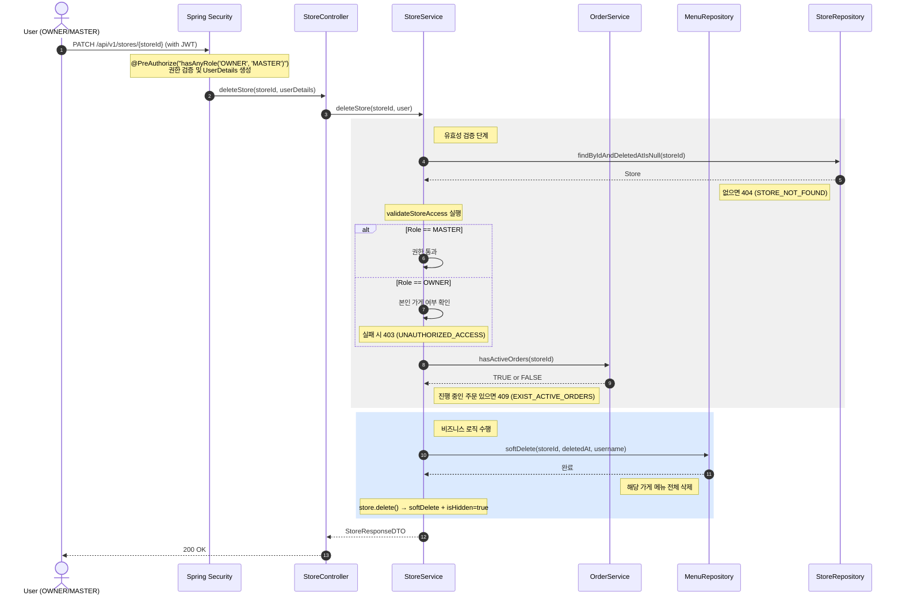

## 가게 삭제

**관련 도메인**: Store, Order, Menu  
**권한**: OWNER, MASTER

### 주요 흐름

- MASTER는 모든 가게 삭제 가능
- OWNER는 본인 가게만 삭제 가능 (타 가게 접근 시 403)
- 진행중인 주문이 있으면 삭제 불가 (409 EXIST_ACTIVE_ORDERS)
- 가게 삭제 전 해당 가게 메뉴 전체 softDelete 처리
- 가게 softDelete + isHidden=true 처리

