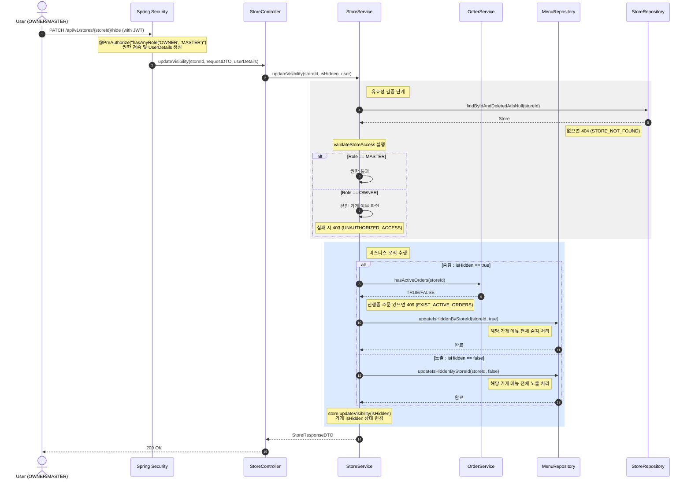

## 가게 숨김 여부 변경

**관련 도메인**: Store, Order, Menu  
**권한**: OWNER, MASTER

### 주요 흐름

- MASTER는 모든 가게 숨김 여부 변경 가능
- OWNER는 본인 가게만 변경 가능 (타 가게 접근 시 403)
- 숨김 처리 시 진행중인 주문이 있으면 변경 불가 (409 EXIST_ACTIVE_ORDERS)
- 숨김 처리 시 해당 가게 메뉴 전체 숨김 처리
- 노출 처리 시 해당 가게 메뉴 전체 노출 처리

