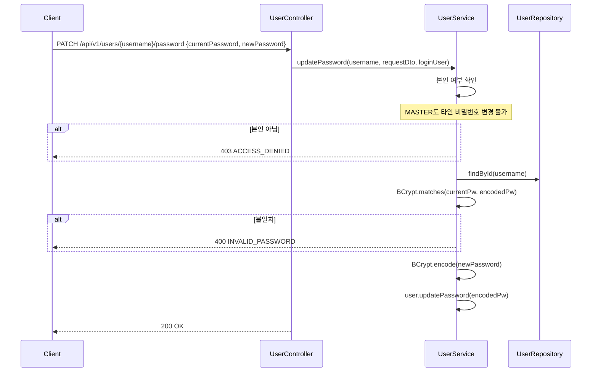

## 비밀번호 변경

### 주요 로직
- 본인 확인 검증, MASTER권한도 접근 불가
- `Bcypt.matches`를 통해 비밀번호 확인
- 비밀번호 변경 후 재 암호화

```mermaid
  sequenceDiagram
      participant C as Client
      participant UC as UserController
      participant US as UserService
      participant DB as UserRepository

      C->>UC: PATCH /api/v1/users/{username}/password {currentPassword, newPassword}
      UC->>US: updatePassword(username, requestDto, loginUser)
      US->>US: 본인 여부 확인
      Note over US: MASTER도 타인 비밀번호 변경 불가
      alt 본인 아님
          US-->>C: 403 ACCESS_DENIED
      end
      US->>DB: findById(username)
      US->>US: BCrypt.matches(currentPw, encodedPw)
      alt 불일치
          US-->>C: 400 INVALID_PASSWORD
      end
      US->>US: BCrypt.encode(newPassword)
      US->>US: user.updatePassword(encodedPw)
      UC-->>C: 200 OK
```