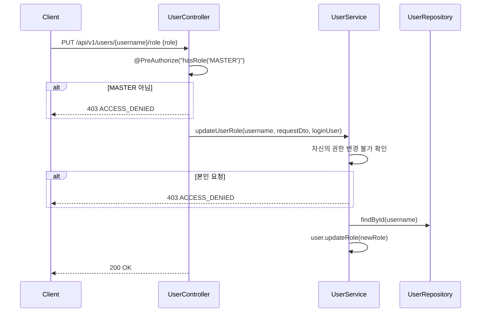

## 권한 변경

### 주요 로직
- `@PreAuthorize`를 통해 컨트롤러에서 권한 체크
- MASTER권한 사용자가 본인의 권한 변경 불가

```mermaid
sequenceDiagram
    participant C as Client
    participant UC as UserController
    participant US as UserService
    participant DB as UserRepository

      C->>UC: PUT /api/v1/users/{username}/role {role}
      UC->>UC: @PreAuthorize("hasRole('MASTER')")
      alt MASTER 아님
          UC-->>C: 403 ACCESS_DENIED
      end
      UC->>US: updateUserRole(username, requestDto, loginUser)
      US->>US: 자신의 권한 변경 불가 확인
      alt 본인 요청
          US-->>C: 403 ACCESS_DENIED
      end
      US->>DB: findById(username)
      US->>US: user.updateRole(newRole)
      UC-->>C: 200 OK
```