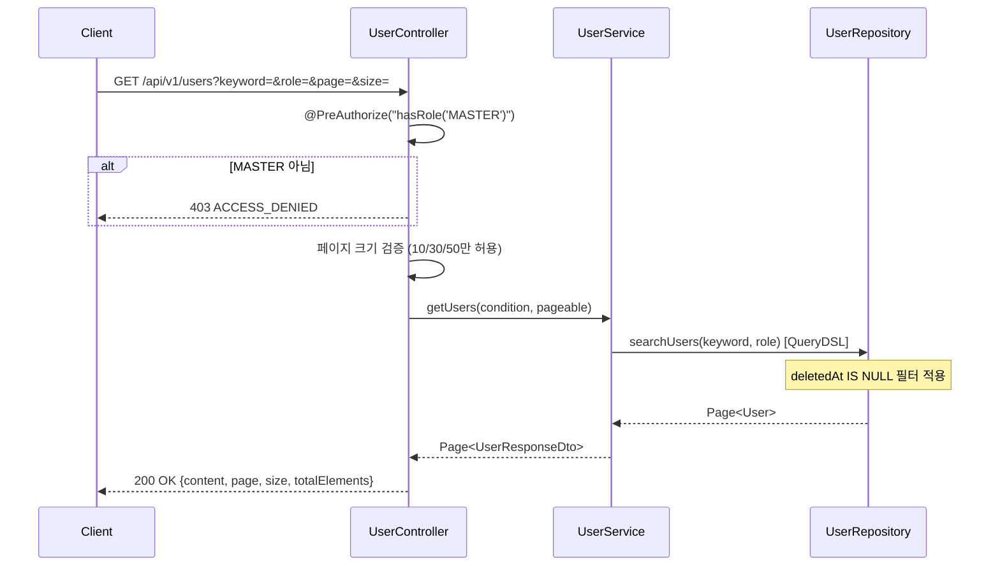

## 사용자 목록 조회

### 주요 로직
- `@PreAuthorize`를 통해 컨트롤러에서 MASTER권한인지 체크
- 페이지 크기를 10,30, 50로 제한
- keyword(아이디, 닉네임)와 role조건을 조합하여 동적 검색

```mermaid
  sequenceDiagram
      participant C as Client
      participant UC as UserController
      participant US as UserService
      participant DB as UserRepository

      C->>UC: GET /api/v1/users?keyword=&role=&page=&size=
      UC->>UC: @PreAuthorize("hasRole('MASTER')")
      alt MASTER 아님
          UC-->>C: 403 ACCESS_DENIED
      end
      UC->>UC: 페이지 크기 검증 (10/30/50만 허용)
      UC->>US: getUsers(condition, pageable)
      US->>DB: searchUsers(keyword, role) [QueryDSL]
      Note over DB: deletedAt IS NULL 필터 적용
      DB-->>US: Page<User>
      US-->>UC: Page<UserResponseDto>
      UC-->>C: 200 OK {content, page, size, totalElements}
```